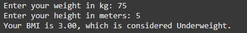

# BMI Calculator

A BMI (Body Mass Index) calculator is a tool used to estimate body fat based on a person's weight and height. It is commonly used to categorize individuals as underweight, normal weight, overweight, or obese. Here's how you can calculate BMI:

## BMI Formula:
$$
\text{BMI} = \frac{\text{Weight (kg)}}{\text{Height (m)}^2}
$$

## Steps to Calculate BMI:
1. **Measure your weight** in kilograms (kg).
2. **Measure your height** in meters (m).
3. **Square your height** (multiply height by itself).
4. **Divide your weight** by the squared height.

## Example:
$$
\text{BMI} = \frac{70}{1.75 \times 1.75} = \frac{70}{3.0625} \approx 22.86
$$

## BMI Categories:
- **Underweight**: BMI < 18.5
- **Normal weight**: BMI 18.5–24.9
- **Overweight**: BMI 25–29.9
- **Obesity**: BMI ≥ 30

## Advantages of BMI Calculator:
- **Simplicity**: Easy to use and requires only basic measurements (weight and height).
- **Quick Assessment**: Provides a rapid estimation of body fat and categorizes weight status.
- **Non-Invasive**: Does not require any invasive procedures or expensive equipment.
- **Widely Recognized**: Accepted and used globally by health professionals.

## Disadvantages of BMI Calculator:
- **Does Not Account for Muscle Mass**: May misclassify muscular individuals as overweight or obese.
- **Does Not Consider Fat Distribution**: Does not provide information on where fat is distributed in the body.
- **Age and Gender Differences**: May not be accurate for all age groups and genders.
- **Ethnic Variations**: May not be equally applicable to all ethnic groups due to differences in body composition.

### Python Code

## Using if, elif, and else statements
```python
# The code below demonstrates my python script for calculating Body Mass Index (BMI) and determining the weight category of a person
# The code takes in the weight and height of a person and calculates the BMI
# The code then prints the BMI and the category weight of the person rounded to two decimal places (the categories are underweight, normal weight, overweight, and obese)

# Get user input for weight and height
weight = float(input("Enter your weight in kilograms: "))
height = float(input("Enter your height in meters: "))

# Calculate BMI using the formula: weight / (height^2)
bmi = weight / (height ** 2)

# Determine BMI category and provide feedback
if bmi < 18.5:
     print(f"Your BMI is {bmi:.2f} which means you are underweight.") # For the underweight category
elif 18.5 <= bmi < 25:
     print(f"Your BMI is {bmi:.2f} which means you are in the normal weight range.") # For the normal weight category
elif 25 <= bmi < 30:
     print(f"Your BMI is {bmi:.2f} which means you are overweight.") # For the overweight category
else:
     print(f"Your BMI is {bmi:.2f} which means you are obese.") # For the obese category
```
# Sample Output:


## Using Functions
```python
# bmi_calculator.py
# This program calculates Body Mass Index (BMI) and categorizes it

# Function to calculate BMI using weight and height
def calculate_bmi(weight, height):
     # BMI formula: weight divided by height squared
     bmi = weight / (height ** 2)
     # Return the calculated BMI value
     return bmi

# Function to determine BMI category based on BMI value
def get_bmi_category(bmi):
     # Underweight category: BMI less than 18.5
     if bmi < 18.5:
          return "Underweight"
     # Normal weight category: BMI between 18.5 and 24.9
     elif 18.5 <= bmi < 24.9:
          return "Normal weight"
     # Overweight category: BMI between 25 and 29.9
     elif 25 <= bmi < 29.9:
          return "Overweight"
     # Obese category: BMI 30 or higher
     else:
          return "Obese"

# Main function that runs the program
def main():
     try:
          # Get user input for weight in kilograms
          weight = float(input("Enter your weight in kg: "))
          # Get user input for height in meters
          height = float(input("Enter your height in meters: "))
          # Calculate BMI using the calculate_bmi function
          bmi = calculate_bmi(weight, height)
          # Get BMI category using the get_bmi_category function
          category = get_bmi_category(bmi)
          # Display the results to the user
          print(f"Your BMI is {bmi:.2f}, which is considered {category}.")
     except ValueError:
          # Handle invalid input gracefully
          print("Please enter valid numbers for weight and height.")

# Run the main function when the script is executed
if __name__ == "__main__":
     main()
```
# Sample Output:

